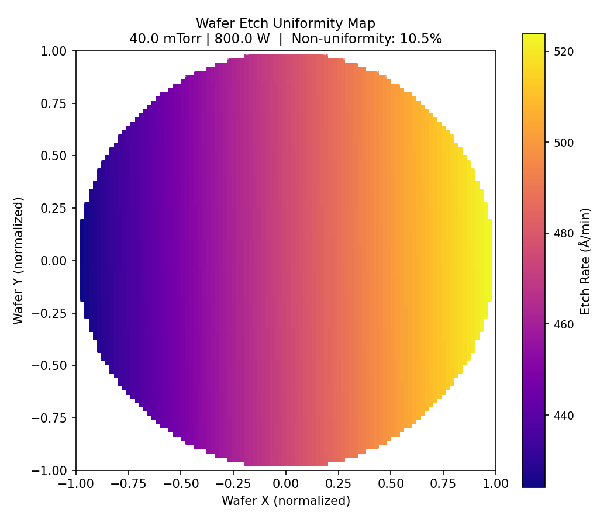
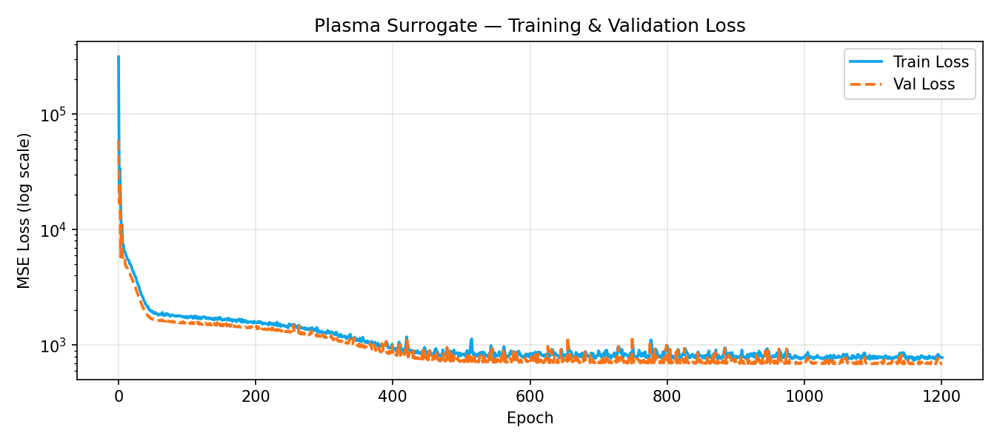

# Plasma Etch Surrogate Model

A neural network surrogate that mimics a **LAM Research plasma etch chamber** — predicting etch rate across the wafer in real time without running an expensive simulation or physical experiment.

Built as a demonstration of **AI-driven process modeling** for semiconductor manufacturing.

---

## What This Does

Traditional plasma etch simulation (e.g. using COMSOL or Modulus) is computationally expensive. This project trains a lightweight MLP to act as a **digital twin** of the chamber: given process recipe parameters, it predicts the etch rate at any wafer location in milliseconds.

```
Inputs:  (x, y) wafer position + chamber pressure + RF power
Output:  Etch rate [Å/min]
```

---

## Results

| Metric | Value |
|---|---|
| Model Accuracy (MAPE-based) | ~94.98% |
| Inference time (CPU) | < 1 ms per point |
| Wafer grid prediction (100×100) | < 50 ms |

**Wafer Uniformity Map** — spatial etch rate distribution at 40 mTorr / 800 W:



**Training & Validation Loss Curve:**



---

## Project Structure

```
plasma-surrogate/
├── model.py                  # Shared model architecture (import this everywhere)
├── generate_etch_data.py     # Synthetic dataset generation with physics noise
├── train_lam_model.py        # Training with train/val split + early stopping
├── predict_etch.py           # Inference: single prediction + batch evaluation
├── sensitivity_analysis.py   # Local sensitivity + full parameter sweep plots
├── plot_wafer_map.py         # Wafer-level etch uniformity heatmap
├── requirements.txt
└── README.md
```

---

## Quickstart

```bash
# 1. Install dependencies
pip install -r requirements.txt

# 2. Generate synthetic training data
python generate_etch_data.py

# 3. Train the surrogate model
python train_lam_model.py

# 4. Run inference
python predict_etch.py

# 5. Sensitivity analysis + sweep plots
python sensitivity_analysis.py

# 6. Wafer uniformity heatmap
python plot_wafer_map.py
```

---

## Physics Model

The synthetic dataset simulates a realistic plasma etch process:

```
etch_rate = 0.5 × power
          + 2.0 × pressure
          + 50 × sin(3x)           # spatial non-uniformity
          − 30 × r²                # edge depletion effect
          + (power/1000) × 0.3 × pressure   # pressure-power coupling
          + Gaussian noise (σ = 3% of signal)
```

This captures common physical effects in ICP/CCP plasma tools: spatial non-uniformity from gas flow, edge depletion from radical recombination, and cross-coupling between pressure and power.

---

## Model Architecture

```
PlasmaEtchSurrogate(
  Linear(4 → 128) → ReLU
  Linear(128 → 128) → ReLU
  Linear(128 → 1)
)
```

Trained with Adam optimizer + ReduceLROnPlateau scheduler. Early stopping on validation MSE with patience=100 epochs.

---

## Key Findings from Sensitivity Analysis

At the baseline recipe (55 mTorr, 1250 W):
- **+10% RF Power** has a larger impact on etch rate than +10% Pressure
- → The process is **Power-Sensitive** at this operating point
- This matches typical ICP tool behavior where ion energy (set by bias power) dominates

---

## Potential Extensions

- [ ] Add temperature as a 5th input feature
- [ ] Multi-output: predict etch rate + selectivity simultaneously  
- [ ] Physics-informed loss term (PINN) to improve extrapolation
- [ ] Uncertainty quantification via MC Dropout or Deep Ensembles
- [ ] Integration with NVIDIA Modulus for PDE-constrained training

---

## About

Built to demonstrate surrogate modeling concepts for semiconductor process control. The physics model is simplified; real chamber characterization would use DOE (Design of Experiments) data from actual hardware.
